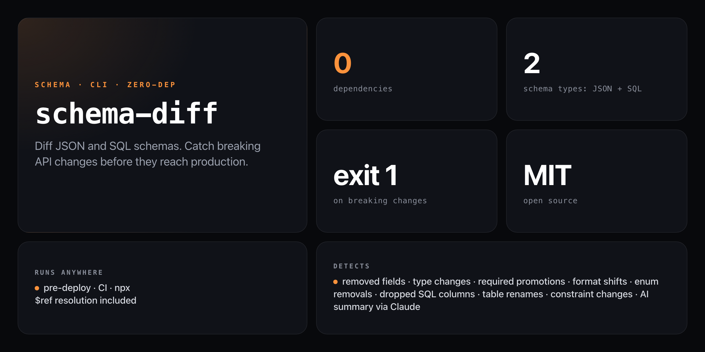

<div align="center">

**Diff JSON Schemas and SQL schemas. Know exactly what changed — and whether it breaks your API contract.**


</div>

---

A schema change that looks minor can silently break consumers. `schema-diff` compares two versions of a JSON Schema or SQL schema file, classifies every change as breaking or non-breaking, and exits `1` if any breaking changes are found — making it safe to use as a CI gate.

```
schema-diff v1.json v2.json

schema-diff · User Schema
━━━━━━━━━━━━━━━━━━━━━━━━━━━━━━━━━━━━━━━━━━

+ properties.phone         string (optional)
~ properties.email.format  "email" → "uri"    ⚠ breaking
- properties.username      removed             ⚠ breaking

━━━━━━━━━━━━━━━━━━━━━━━━━━━━━━━━━━━━━━━━━━
2 breaking · 1 non-breaking
```

## Install

No install, no npm account — run straight from GitHub with zero dependencies:

```bash
npx github:NickCirv/schema-diff
```

## Usage

```bash
# diff two JSON Schema files
npx github:NickCirv/schema-diff v1.json v2.json

# diff two SQL schema files
npx github:NickCirv/schema-diff v1.sql v2.sql

# show only breaking changes
npx github:NickCirv/schema-diff v1.json v2.json --breaking

# machine-readable JSON output
npx github:NickCirv/schema-diff v1.json v2.json --format json

# RFC 6902 JSON Patch output
npx github:NickCirv/schema-diff v1.json v2.json --format patch

# ignore an internal path
npx github:NickCirv/schema-diff v1.json v2.json --ignore properties.internal

# AI-powered plain-English summary (requires ANTHROPIC_API_KEY)
npx github:NickCirv/schema-diff v1.json v2.json --ai
```

| Flag | Description |
|------|-------------|
| `--breaking` | Show only breaking changes |
| `--format table\|json\|patch` | Output format (default: `table`) |
| `--ignore <path>` | Ignore a property path (repeatable) |
| `--ai` | Print an AI plain-English summary via `ANTHROPIC_API_KEY` |
| `-v, --version` | Show version |
| `-h, --help` | Show help |

## What counts as breaking

| Schema type | Breaking changes detected |
|-------------|--------------------------|
| **JSON Schema** | Field removed · type narrowed · `required` promoted · `format` changed · enum values removed · pattern made stricter · `minimum`/`maximum` tightened |
| **SQL** | Column dropped · type changed · `NOT NULL` added without default · column size shrunk · foreign key reference removed · table dropped |

Non-breaking changes (field added optional, enum values added, table added) are shown but do not trigger exit `1`.

## CI usage

Exit code `1` if any breaking change is detected — safe to fail your pipeline:

```yaml
- name: Guard schema contract
  run: npx github:NickCirv/schema-diff schema-v1.json schema-v2.json
```

## $ref resolution

JSON Schema `$ref` pointers (internal `#/` references) are resolved before diffing, so `$defs`-based schemas work correctly.

## What it is NOT

- **Not a migration generator.** It tells you what changed — it does not write the migration SQL or code for you.
- **Not a JSON Schema validator.** It diffs schemas against each other, not against instance data.
- **Not exhaustive on SQL.** It parses `CREATE TABLE` statements. Complex SQL (views, triggers, stored procedures) is out of scope.

---

<div align="center">
<sub>Zero dependencies · Node 18+ · MIT · by <a href="https://github.com/NickCirv">NickCirv</a></sub>
</div>
