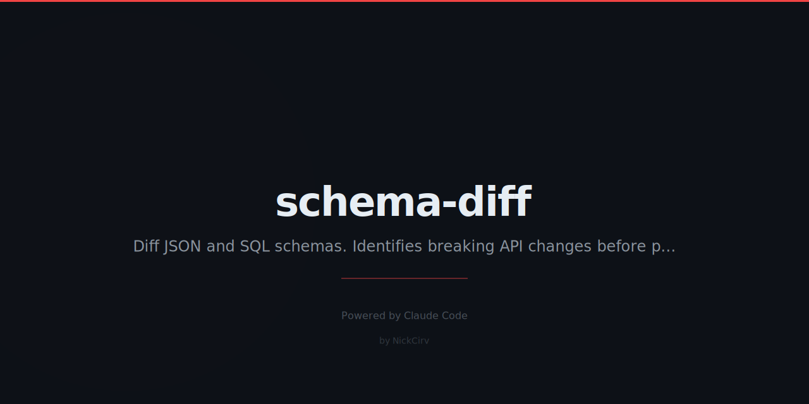

# schema-diff
> Diff JSON Schemas and SQL schemas. Spot breaking API changes before they hit production.

```bash
npx schema-diff schema-v1.json schema-v2.json
```

```
schema-diff · User Schema: v1 → v2
━━━━━━━━━━━━━━━━━━━━━━━━━━━━━━━━━━━━━━

+ properties.phone         string (new optional field)
~ properties.email.format  "email" → "uri"    ⚠ breaking
- properties.username      removed             ⚠ breaking

━━━━━━━━━━━━━━━━━━━━━━━━━━━━━━━━━━━━━━
2 breaking changes · 1 non-breaking
```

## Commands
| Command | Description |
|---------|-------------|
| `schema-diff <f1> <f2>` | Diff two JSON Schema files |
| `schema-diff <f1.sql> <f2.sql>` | Diff two SQL schema files |
| `--breaking` | Show only breaking changes |
| `--format json\|patch\|table` | Output format |
| `--ignore <path>` | Ignore a property path |

## Install
```bash
npx schema-diff
npm install -g schema-diff
```

---
**Zero dependencies** · **Node 18+** · Made by [NickCirv](https://github.com/NickCirv) · MIT
